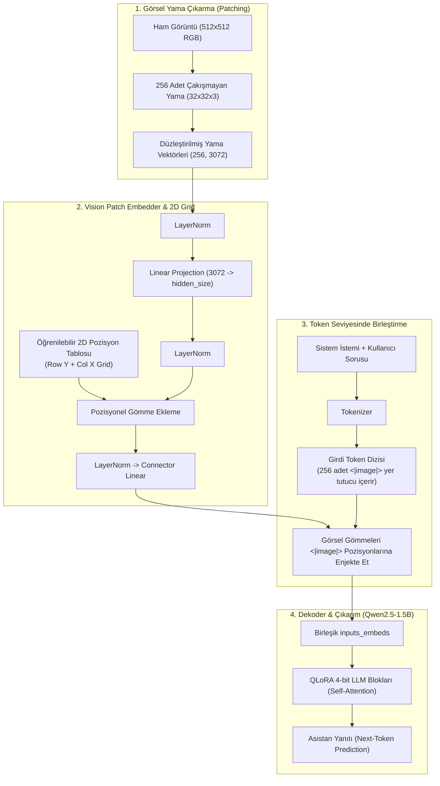

# 👁️‍🗨️ Encoder-Free Vision-Language Model (VLM) - Staj Projesi

[](https://www.python.org/)
[](https://pytorch.org/)
[](https://huggingface.co/)
[](https://colab.research.google.com/)
[](LICENSE)

Bu depo, *"Train Your Own Encoder-Free VLM in $100"* çalışmasını temel alan ve **30 günlük staj müfredatının** kod tabanını barındıran; harici bir görsel kodlayıcıya (Vision Transformer / ViT) ihtiyaç duymadan, ham görsel yamalarını doğrudan bir Büyük Dil Modeline (LLM) entegre eden uçtan uca bir yapay zeka mühendisliği projesidir.

Proje, Google Colab'in ücretsiz **T4 GPU** donanım kısıtları (15 GB VRAM & 12 GB RAM) göz önünde bulundurularak 4-bit QLoRA, hafıza dostu veri akışı (streaming), çift öğrenme oranı ve otomatik Google Drive senkronizasyonu ile baştan sona optimize edilmiştir.

---

## 📌 İçindekiler
- [Projenin Amacı ve Motivasyonu](#-projenin-amacı-ve-motivasyonu)
- [Neden "Encoder-Free" (Görsel Kodlayıcısız)?](#-neden-encoder-free-görsel-kodlayıcısız)
- [Mimari ve Çalışma Mantığı](#-mimari-ve-çalışma-mantığı)
- [Eğitim Stratejisi ve MLOps Dayanıklılığı](#-eğitim-stratejisi-ve-mlops-dayanıklılığı)
- [⚡ Hızlı Başlangıç (Google Colab & Yerel)](#-hızlı-başlangıç-google-colab--yerel)
- [📂 Proje Dizin Yapısı](#-proje-dizin-yapısı)
- [Model Seçimi ve Öneriler](#-model-seçimi-ve-öneriler)
- [🗓️ 30 Günlük Müfredat Özeti](#️-30-günlük-müfredat-özeti)
- [📜 Lisans ve Kaynakça](#-lisans-ve-kaynakça)

---

## 🎯 Projenin Amacı ve Motivasyonu

Geleneksel Görsel Dil Modelleri (VLM - örn. LLaVA, BLIP, CLIP-tabanlı modeller); görüntüleri anlamlandırmak için önceden eğitilmiş devasa bir Vision Transformer (ViT / CLIP / SigLIP) ve ardından bu özellikleri dil modeline aktaran bir MLP projeksiyon katmanı kullanır.

Bu projede hedeflenen amaçlar:
1. **Harici Görsel Kodlayıcıyı Ortadan Kaldırmak**: Milyonlarca parametrelik ağır bir ViT yerine, yalnızca tek bir lineer projeksiyon katmanı ve 2D pozisyon matrisleriyle görüntüleri doğrudan LLM'in token uzayına yansıtmak.
2. **Hesaplama ve Bellek Verimliliği**: Ayrı bir görsel omurganın GPU hafıza yükünü kaldırarak, ücretsiz Google Colab T4 üzerinde dahi 1.5B parametrelik bir talimat modelini (Qwen2.5-1.5B-Instruct) 4-bit hassasiyetle eğitebilmek.
3. **Uçtan Uca Çok Modlu Entegrasyon**: Dil modelinin kendi dikkat (attention) mekanizmasını görsel yamaları doğrudan birer metin token'ı gibi işleyecek şekilde eğitmek.

---

## 💡 Neden "Encoder-Free" (Görsel Kodlayıcısız)?

| Özellik | Geleneksel VLM (örn. LLaVA-1.5) | Encoder-Free VLM (Bu Proje) |
| :--- | :--- | :--- |
| **Görsel Omurga** | CLIP ViT-L/14 (~300M parametre, dondurulmuş) | **Yok** (Sadece ~4.7M parametrelik lineer embedder) |
| **Görsel Çıkarım** | Ağır Transformer katmanları | **Doğrudan piksel yamaları + 2D Pos Emb** |
| **VRAM Tüketimi** | Yüksek (ViT aktivasyonları + LLM) | **Çok Düşük** (Tek omurga olarak yalnızca LLM) |
| **Donanım Uyumluluğu** | Genellikle A100 / en az A10G gerektirir | **Ücretsiz Colab T4 GPU (15GB) ile tam uyumlu** |
| **Eğitim Esnekliği** | Görsel ve dil hizalamasında darboğaz | **Doğrudan LLM token uzayına gömme** |

---

## 🧠 Mimari ve Çalışma Mantığı

Aşağıdaki şema, ham bir görüntünün ve kullanıcı sorusunun modele girdiği andan itibaren yanıtın üretilmesine kadar olan akışı özetler:



### 1. Görsel Ön İşleme ve Yama Çıkarma (`patching.py`, `image_processing.py`)
- Girdi görüntüsü en-boy oranı korunarak $512 \times 512$ piksele yeniden boyutlandırılır ve kırpılır.
- Görüntü, $32 \times 32$ boyutunda $16 \times 16 = 256$ adet çakışmayan yamaya (patch) bölünür.
- Her yama düzleştirilerek $32 \times 32 \times 3 = 3072$ boyutunda bir vektör elde edilir.

### 2. Görsel Yama Gömücü (`embedder.py`)
- Ham yama vektörleri şu dönüşüm zincirinden geçirilir:
  $$\text{Patch} \xrightarrow{} \text{LayerNorm} \xrightarrow{} \text{Linear}(3072 \rightarrow \text{hidden\_size}) \xrightarrow{} \text{LayerNorm}$$
- **Ayrıştırılmış 2D Pozisyonel Gömme (2D Grid Positional Embeddings)**: Görüntünün ızgara yapısını korumak amacıyla satır ($Y$) ve sütun ($X$) koordinatları için ayrı ayrı öğrenilebilir parametre tabloları tanımlanır ve toplanarak yama vektörlerine eklenir:
  $$\text{pos}_{(i, j)} = \text{pos\_y}_i + \text{pos\_x}_j$$
- Son bir `LayerNorm` ve `Linear Connector` katmanından sonra görsel token'lar dil modelinin gizli uzayına aktarılır.

### 3. Çok Modlu Dizilim ve Yer Tutucu Enjeksiyonu (`model.py`, `tokenization.py`)
- Metin şablonuna 256 adet `<|image|>` özel yer tutucu token'ı eklenir.
- Girdi metni dil modelinin gömme matrisine (`embed_tokens`) verildikten sonra, `<|image|>` token'larının bulunduğu indeksler tespit edilir ve bu konumlara doğrudan görsel gömücünün ürettiği 256 vektör yazılır.

### 4. Yanıta Özel Kayıp Maskelemesi (Response-Only SFT Loss - `loss.py`)
- Modelin eğitiminde dil modelleme kaybı hesaplanırken:
  - Görüntü yamalarının bulunduğu indeksler,
  - Sistem istemi ve kullanıcı soru token'ları,
  - Dolgu (padding) token'ları
  tamamen `-100` (`ignore_index`) değeri ile maskelenir.
- **Kayıp (Cross-Entropy Loss)** yalnızca asistanın ürettiği yanıt token'ları üzerinden hesaplanır.

---

## ⚙️ Eğitim Stratejisi ve MLOps Dayanıklılığı

| Bileşen / Strateji | Detay ve Uygulama |
| :--- | :--- |
| **Kuantizasyon & QLoRA** | 4-bit NormalFloat4 (NF4) tabanlı kuantizasyon, $r=16, \alpha=32$ LoRA adaptörleri. |
| **Çift Öğrenme Oranı** | Sıfırdan öğrenen Vision Embedder için $3.5 \times 10^{-4}$, önceden eğitilmiş LLM LoRA katmanları için $4.0 \times 10^{-5}$. |
| **Google Drive Auto-Sync** | Her 50 adımda bir alınan checkpoint'ler otomatik olarak `/content/drive/MyDrive/...` dizinine kopyalanır. |
| **Kesintisiz Devam (Auto-Resume)** | Colab oturumu kopsa bile, script yeniden çalıştırıldığında Drive'daki en son checkpoint adımını (örn. `checkpoint-250`) algılar ve kaldığı adımdan eğitime devam eder. |
| **Veri Akışı (Streaming) & Kalite Filtresi** | `HuggingFaceM4/FineVision` veri seti (LLaVA-Instruct %80, ShareGPT4V %20) RAM'e yüklenmeden stream edilir. `image_correspondence >= 4` ve `visual_dependency >= 3` filtreleriyle düşük kaliteli örnekler elenir. |
| **Overfit Doğrulama Modu** | `--overfit-test` bayrağı ile eğitim öncesi 8 örnek üzerinde 12 adımda modelin öğrenme kapasitesi (~1 dakikada) test edilir. |

---

## ⚡ Hızlı Başlangıç (Google Colab & Yerel)

### Seçenek A: Google Colab (Önerilen - 1 Tıkla Çalıştırma)
Tüm adımları interaktif olarak çalıştırmak için hazır Colab defterini kullanabilirsiniz:
[](https://github.com/MelihTalha1/Encoder_Free-VLM/blob/main/notebooks/Encoder_Free_VLM_Colab.ipynb)

---

### Seçenek B: Terminal / Yerel Kurulum

```bash
# 1. Repoyu klonlayın ve dizine gidin
git clone https://github.com/MelihTalha1/Encoder_Free-VLM.git
cd Encoder_Free-VLM

# 2. Gereksinimleri yükleyin
pip install -r requirements.txt

# 3. Hugging Face hesabınıza giriş yapın (FineVision veri seti ve modeller için)
huggingface-cli login
```

#### 1. Smoke Test (Şekil ve Boyut Doğrulaması - Gün 7)
İleri ve geri yayılımın (forward/backward pass) boyut uyuşmazlığı olmadan çalıştığını doğrulayın:
```bash
python scripts/smoke_test.py
```

#### 2. Aşırı Öğrenme (Overfit) Doğrulama Testi (Gün 19)
Modelin kaybının (loss) hızla düştüğünü ve gradyanların düzgün aktığını ~1 dakikalık testle kontrol edin:
```bash
python scripts/train.py --config configs/colab_t4.yaml --overfit-test
```

#### 3. Ana QLoRA Eğitimini Başlatma (Gün 21)
```bash
python scripts/train.py --config configs/colab_t4.yaml
```
> **Not:** Google Drive bağlıysa (`/content/drive/MyDrive`), checkpoint'ler otomatik eşitlenir. Colab kesilirse aynı komutla kaldığı adımdan sorunsuz devam eder.

#### 4. LoRA Ağırlıklarını Taban Model ile Birleştirme (Gün 24)
Eğitilen LoRA adaptörlerini taban LLM ile kalıcı olarak birleştirip tek bir bağımsız model haline getirin:
```bash
python scripts/merge_lora.py \
  --base-model Qwen/Qwen2.5-1.5B-Instruct \
  --checkpoint-dir outputs/encoder_free_vlm_qwen15b \
  --output-dir outputs/encoder_free_vlm_qwen15b/merged
```

#### 5. Görsel Soru-Cevap (VQA) Çıkarımı (Gün 25 & 28)
Tek bir görüntü üzerinde terminalden çıkarım yapın:
```bash
python scripts/infer.py \
  --base-model Qwen/Qwen2.5-1.5B-Instruct \
  --checkpoint-dir outputs/encoder_free_vlm_qwen15b/checkpoint-500 \
  --image ornek_resim.jpg \
  --prompt "Bu fotoğrafta ne görüyorsun? Detaylıca açıkla." \
  --system-prompt "Sen görsel detayları dikkatle inceleyen yardımsever bir asistansın."
```

#### 6. İnteraktif Gradio Web Arayüzünü Başlatma (Gün 29)
Kullanıcı dostu web arayüzünü (Colab için genel paylaşım linkiyle) başlatın:
```bash
python app.py \
  --base-model Qwen/Qwen2.5-1.5B-Instruct \
  --checkpoint-dir outputs/encoder_free_vlm_qwen15b/checkpoint-500
```

---

## 📂 Proje Dizin Yapısı

```text
├── configs/
│   └── colab_t4.yaml            # Colab T4 için optimize edilmiş hiperparametreler
├── notebooks/
│   └── Encoder_Free_VLM_Colab.ipynb # Adım adım Google Colab çalışma defteri
├── scripts/
│   ├── smoke_test.py            # Tensör boyutları ve gradyan akışı doğrulama testi
│   ├── train.py                 # QLoRA, Drive sync ve auto-resume destekli eğitim scripti
│   ├── infer.py                 # Bağımsız çıkarım (inference) boru hattı
│   └── merge_lora.py            # LoRA adaptörlerini ana modele kaynaştırma scripti
├── src/
│   └── encoder_free_vlm/        # Çekirdek Python paketi
│       ├── config.py            # Veri sınıfları (ModelConfig, VisionConfig vb.)
│       ├── data.py              # Streaming veri kümesi, kalite filtreleme ve collator
│       ├── embedder.py          # VisionPatchEmbedder ve 2D pozisyon matrisleri
│       ├── generation.py        # Çıkarım döngüsü ve Greedy/Sampling üretimi
│       ├── image_processing.py  # Görüntü boyutlandırma ve tensör ön işleme
│       ├── loss.py              # Yanıta özel kayıp (Response-only cross entropy)
│       ├── model.py             # EncoderFreeVLM ana model sınıfı
│       ├── patching.py          # Görselleri 32x32 yamalara ayırma mantığı
│       ├── tokenization.py      # <|image|> token yönetimi ve sohbet şablonları
│       └── train_utils.py       # Checkpoint arama, optimizer ve model inşa yardımcıları
├── tests/
│   └── test_smoke.py            # Otomatik pytest birim testleri
├── app.py                       # Gradio tabanlı interaktif web kullanıcı arayüzü
├── requirements.txt             # Gerekli Python kütüphaneleri
└── pyproject.toml               # Paket yapılandırma ve meta verileri
```

---

## 🧩 Model Seçimi ve Öneriler

Bu projede iki farklı dekoder mimarisi desteklenmektedir:

1. **`HuggingFaceTB/SmolLM2-135M-Instruct`**:
   - ~135M parametreli çok hafif bir modeldir.
   - Kodun test edilmesi, CPU üzerinde hata ayıklama ve hızlı overfit testleri için idealdir.
   - Ancak boyutu nedeniyle derin görsel muhakeme ve karmaşık nesne algılama kabiliyeti sınırlıdır.

2. **`Qwen/Qwen2.5-1.5B-Instruct` (Varsayılan ve Tavsiye Edilen)**:
   - 1.5B parametre ile görsel-dil hizalamasını yüksek doğrulukla öğrenir.
   - 4-bit QLoRA ve Gradient Checkpointing sayesinde Colab T4 VRAM'ine (~7-8 GB) rahatlıkla sığar.
   - Nesne tanıma, görsel soru-cevap ve sahne betimleme görevlerinde güçlü görsel kavrayış (visual grounding) sergiler.

---

## 🗓️ 30 Günlük Müfredat Özeti

| Hafta | Odak Alanı | Kapsanan Konular ve Çıktılar |
| :--- | :--- | :--- |
| **1. Hafta (Gün 1-7)** | **Temel Mimari ve Yama Çıkarma** | Görsel ön işleme, 32x32 yama çıkarma, `VisionPatchEmbedder`, 2D pozisyon matrisleri ve `smoke_test.py`. |
| **2. Hafta (Gün 8-14)** | **Veri ve Şablon Entegrasyonu** | `<|image|>` token enjeksiyonu, sohbet şablonları (ChatML), yanıta özel kayıp maskelemesi (`-100`) ve veri collator'ı. |
| **3. Hafta (Gün 15-21)** | **Eğitim Boru Hattı ve MLOps** | FineVision streaming veri yükleme, kalite filtreleri, `--overfit-test` doğrulama, 4-bit QLoRA ve Google Drive auto-sync. |
| **4. Hafta (Gün 22-30)** | **Ağırlık Birleştirme, Çıkarım ve UI** | LoRA birleştirme (`merge_lora.py`), tekli çıkarım boru hattı (`infer.py`), Gradio web arayüzü (`app.py`) ve Colab yayını. |

---

## 📜 Lisans ve Kaynakça

- **Referans Çalışma**: [Train Your Own Encoder-Free VLM in $100](https://github.com/MelihTalha1/Encoder_Free-VLM)
- **Veri Seti**: [HuggingFaceM4/FineVision](https://huggingface.co/datasets/HuggingFaceM4/FineVision)
- **Lisans**: [MIT License](LICENSE)
