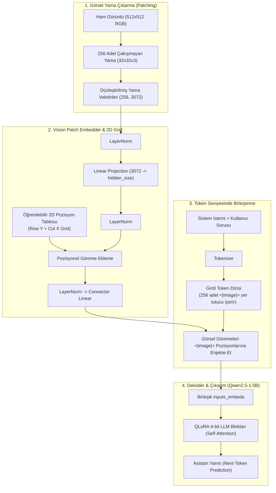

# 👁️‍🗨️ Encoder-Free Vision-Language Model (VLM)

[](https://www.python.org/)
[](https://pytorch.org/)
[](https://huggingface.co/)
[](https://colab.research.google.com/)


Bu depo, *"Train Your Own Encoder-Free VLM in $100"* çalışmasını temel alan; harici bir görsel kodlayıcıya (Vision Transformer / ViT) ihtiyaç duymadan, ham görsel yamalarını doğrudan bir Büyük Dil Modeline (LLM) entegre eden uçtan uca bir yapay zeka mühendisliği projesidir.

Proje, Google Colab'in ücretsiz **T4 GPU** donanım kısıtları (15 GB VRAM & 12 GB RAM) göz önünde bulundurularak 4-bit QLoRA, hafıza dostu veri akışı (streaming), çift öğrenme oranı ve otomatik Google Drive senkronizasyonu ile baştan sona optimize edilmiştir.

---

## 📌 İçindekiler
- [Projenin Amacı ve Motivasyonu](#-projenin-amacı-ve-motivasyonu)
- [Neden "Encoder-Free" (Görsel Kodlayıcısız)?](#-neden-encoder-free-görsel-kodlayıcısız)
- [Mimari ve Çalışma Mantığı](#-mimari-ve-çalışma-mantığı)
- [Eğitim Stratejisi ve MLOps Dayanıklılığı](#-eğitim-stratejisi-ve-mlops-dayanıklılığı)
- [📂 Proje Dizin Yapısı](#-proje-dizin-yapısı)
- [Model Seçimi ve Öneriler](#-model-seçimi-ve-öneriler)
- [📜 Kaynakça](#-kaynakça)

---

## 🎯 Projenin Amacı ve Motivasyonu

Geleneksel Görsel Dil Modelleri (VLM - örn. LLaVA, BLIP, CLIP-tabanlı modeller); görüntüleri anlamlandırmak için önceden eğitilmiş devasa bir Vision Transformer (ViT / CLIP / SigLIP) ve ardından bu özellikleri dil modeline aktaran bir MLP projeksiyon katmanı kullanır.

Bu projede hedeflenen amaçlar:
1. **Harici Görsel Kodlayıcıyı Ortadan Kaldırmak**: Milyonlarca parametrelik ağır bir ViT yerine, yalnızca tek bir lineer projeksiyon katmanı ve 2D pozisyon matrisleriyle görüntüleri doğrudan LLM'in token uzayına yansıtmak.
2. **Hesaplama ve Bellek Verimliliği**: Ayrı bir görsel omurganın GPU hafıza yükünü kaldırarak, ücretsiz Google Colab T4 üzerinde dahi 1.5B parametrelik bir talimat modelini (Qwen2.5-1.5B-Instruct) 4-bit hassasiyetle eğitebilmek.
3. **Uçtan Uca Çok Modlu Entegrasyon**: Dil modelinin kendi dikkat (attention) mekanizmasını görsel yamaları doğrudan birer metin token'ı gibi işleyecek şekilde eğitmek.

---

## 💡 Neden "Encoder-Free" (Görsel Kodlayıcısız)?

| Özellik | Geleneksel VLM (örn. LLaVA-1.5) | Encoder-Free VLM (Bu Proje) |
| :--- | :--- | :--- |
| **Görsel Omurga** | CLIP ViT-L/14 (~300M parametre, dondurulmuş) | **Yok** (Sadece ~4.7M parametrelik lineer embedder) |
| **Görsel Çıkarım** | Ağır Transformer katmanları | **Doğrudan piksel yamaları + 2D Pos Emb** |
| **VRAM Tüketimi** | Yüksek (ViT aktivasyonları + LLM) | **Çok Düşük** (Tek omurga olarak yalnızca LLM) |
| **Eğitim Esnekliği** | Görsel ve dil hizalamasında darboğaz | **Doğrudan LLM token uzayına gömme** |

---

## 🧠 Mimari ve Çalışma Mantığı

Aşağıdaki şema, ham bir görüntünün ve kullanıcı sorusunun modele girdiği andan itibaren yanıtın üretilmesine kadar olan akışı özetler:



### 1. Görsel Ön İşleme ve Yama Çıkarma (`patching.py`, `image_processing.py`)
- Girdi görüntüsü en-boy oranı korunarak $512 \times 512$ piksele yeniden boyutlandırılır ve kırpılır.
- Görüntü, $32 \times 32$ boyutunda $16 \times 16 = 256$ adet çakışmayan yamaya (patch) bölünür.
- Her yama düzleştirilerek $32 \times 32 \times 3 = 3072$ boyutunda bir vektör elde edilir.

### 2. Görsel Yama Gömücü (`embedder.py`)
- Ham yama vektörleri şu dönüşüm zincirinden geçirilir:
  $$\text{Patch} \to \text{LayerNorm} \to \text{Linear}(3072 \to d) \to \text{LayerNorm}$$
  *(Burada $d$, dil modelinin gizli boyutu olan `hidden_size` değeridir.)*
- **Ayrıştırılmış 2D Pozisyonel Gömme (2D Grid Positional Embeddings)**: Görüntünün ızgara yapısını korumak amacıyla satır ($Y$) ve sütun ($X$) koordinatları için ayrı ayrı öğrenilebilir parametre tabloları tanımlanır ve toplanarak yama vektörlerine eklenir:
  $$\mathbf{P}_{(i, j)} = \mathbf{P}_{y, i} + \mathbf{P}_{x, j}$$
- Son bir `LayerNorm` ve `Linear Connector` katmanından sonra görsel token'lar dil modelinin gizli uzayına aktarılır.

### 3. Çok Modlu Dizilim ve Yer Tutucu Enjeksiyonu (`model.py`, `tokenization.py`)
- Metin şablonuna 256 adet `<|image|>` özel yer tutucu token'ı eklenir.
- Girdi metni dil modelinin gömme matrisine (`embed_tokens`) verildikten sonra, `<|image|>` token'larının bulunduğu indeksler tespit edilir ve bu konumlara doğrudan görsel gömücünün ürettiği 256 vektör yazılır.

### 4. Yanıta Özel Kayıp Maskelemesi (Response-Only SFT Loss - `loss.py`)
- Modelin eğitiminde dil modelleme kaybı hesaplanırken:
  - Görüntü yamalarının bulunduğu indeksler,
  - Sistem istemi ve kullanıcı soru token'ları,
  - Dolgu (padding) token'ları
  tamamen `-100` (`ignore_index`) değeri ile maskelenir.
- **Kayıp (Cross-Entropy Loss)** yalnızca asistanın ürettiği yanıt token'ları üzerinden hesaplanır.

---

## ⚙️ Eğitim Stratejisi ve MLOps Dayanıklılığı

| Bileşen / Strateji | Detay ve Uygulama |
| :--- | :--- |
| **Kuantizasyon & QLoRA** | 4-bit NormalFloat4 (NF4) tabanlı kuantizasyon, $r=16, \alpha=32$ LoRA adaptörleri. |
| **Çift Öğrenme Oranı** | Sıfırdan öğrenen Vision Embedder için $3.5 \times 10^{-4}$, önceden eğitilmiş LLM LoRA katmanları için $4.0 \times 10^{-5}$. |
| **Google Drive Auto-Sync** | Her 50 adımda bir alınan checkpoint'ler otomatik olarak `/content/drive/MyDrive/...` dizinine kopyalanır. |
| **Kesintisiz Devam (Auto-Resume)** | Colab oturumu kopsa bile, script yeniden çalıştırıldığında Drive'daki en son checkpoint adımını (örn. `checkpoint-250`) algılar ve kaldığı adımdan eğitime devam eder. |
| **Veri Akışı (Streaming) & Kalite Filtresi** | `HuggingFaceM4/FineVision` veri seti (LLaVA-Instruct %80, ShareGPT4V %20) RAM'e yüklenmeden stream edilir. `image_correspondence >= 4` ve `visual_dependency >= 3` filtreleriyle düşük kaliteli örnekler elenir. |
| **Overfit Doğrulama Modu** | `--overfit-test` bayrağı ile eğitim öncesi 8 örnek üzerinde 12 adımda modelin öğrenme kapasitesi (~1 dakikada) test edilir. |

---

## 📂 Proje Dizin Yapısı

```text
├── configs/
│   └── colab_t4.yaml            # Colab T4 için optimize edilmiş hiperparametreler
├── notebooks/
│   └── Encoder_Free_VLM_Colab.ipynb # Adım adım Google Colab çalışma defteri
├── scripts/
│   ├── smoke_test.py            # Tensör boyutları ve gradyan akışı doğrulama testi
│   ├── train.py                 # QLoRA, Drive sync ve auto-resume destekli eğitim scripti
│   ├── infer.py                 # Bağımsız çıkarım (inference) boru hattı
│   └── merge_lora.py            # LoRA adaptörlerini ana modele kaynaştırma scripti
├── src/
│   └── encoder_free_vlm/        # Çekirdek Python paketi
│       ├── config.py            # Veri sınıfları (ModelConfig, VisionConfig vb.)
│       ├── data.py              # Streaming veri kümesi, kalite filtreleme ve collator
│       ├── embedder.py          # VisionPatchEmbedder ve 2D pozisyon matrisleri
│       ├── generation.py        # Çıkarım döngüsü ve Greedy/Sampling üretimi
│       ├── image_processing.py  # Görüntü boyutlandırma ve tensör ön işleme
│       ├── loss.py              # Yanıta özel kayıp (Response-only cross entropy)
│       ├── model.py             # EncoderFreeVLM ana model sınıfı
│       ├── patching.py          # Görselleri 32x32 yamalara ayırma mantığı
│       ├── tokenization.py      # <|image|> token yönetimi ve sohbet şablonları
│       └── train_utils.py       # Checkpoint arama, optimizer ve model inşa yardımcıları
├── tests/
│   └── test_smoke.py            # Otomatik pytest birim testleri
├── app.py                       # Gradio tabanlı interaktif web kullanıcı arayüzü
├── requirements.txt             # Gerekli Python kütüphaneleri
└── pyproject.toml               # Paket yapılandırma ve meta verileri
```

---

## 🧩 Model Seçimi ve Öneriler

Bu projede test ve deneme amaçlı iki farklı dekoder (dil modeli) desteklenmektedir:

1. **`HuggingFaceTB/SmolLM2-135M-Instruct` (Hızlı Test ve Doğrulama)**:
   - ~135M parametrelik son derece hafif bir modeldir.
   - Kod akışını, tensör boyutlarını (`smoke_test.py`) ve eğitim boru hattını (`--overfit-test`) birkaç dakika içinde CPU veya ücretsiz GPU'da test etmek için idealdir.
   - **Kısıt:** Parametre sayısı çok küçük olduğu için görsel yamaları anlamlı şekilde öğrenemez; görsel soru-cevap için değil, sadece boru hattının çalıştığını doğrulamak için kullanılmalıdır.

2. **`Qwen/Qwen2.5-1.5B-Instruct` (Varsayılan Model)**:
   - 1.5B parametre ölçeğiyle, Colab T4 üzerinde eğitilebilecek en dengeli temel modeldir.
   - 4-bit QLoRA ve Gradient Checkpointing sayesinde yaklaşık 7-8 GB VRAM kullanarak T4 GPU'da rahatça eğitilebilir.
   - **Beklenti:** Birkaç yüz adımlık (örn. 500 adım) bütçe dostu bir eğitimle görüntülerdeki temel nesneleri ve belirgin sahneleri basit seviyede tarif edebilir. Küçük bir eğitim bütçesiyle konsepti kanıtlamak (Proof-of-Concept) için uygundur; büyük ticari VLM'ler seviyesinde karmaşık akıl yürütme beklenmemelidir.

---


## 📜 Kaynakça

- **Referans Çalışma**: [Train Your Own Encoder-Free VLM in $100](https://huggingface.co/spaces/HuggingFaceM4/encoder-free-vlm)
- **Veri Seti**: [HuggingFaceM4/FineVision](https://huggingface.co/datasets/HuggingFaceM4/FineVision)

